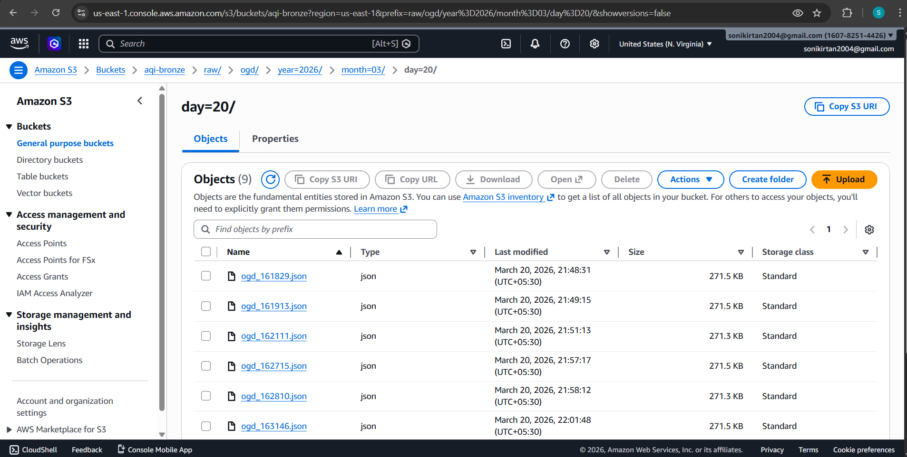
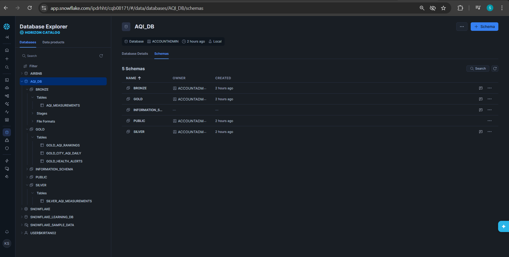
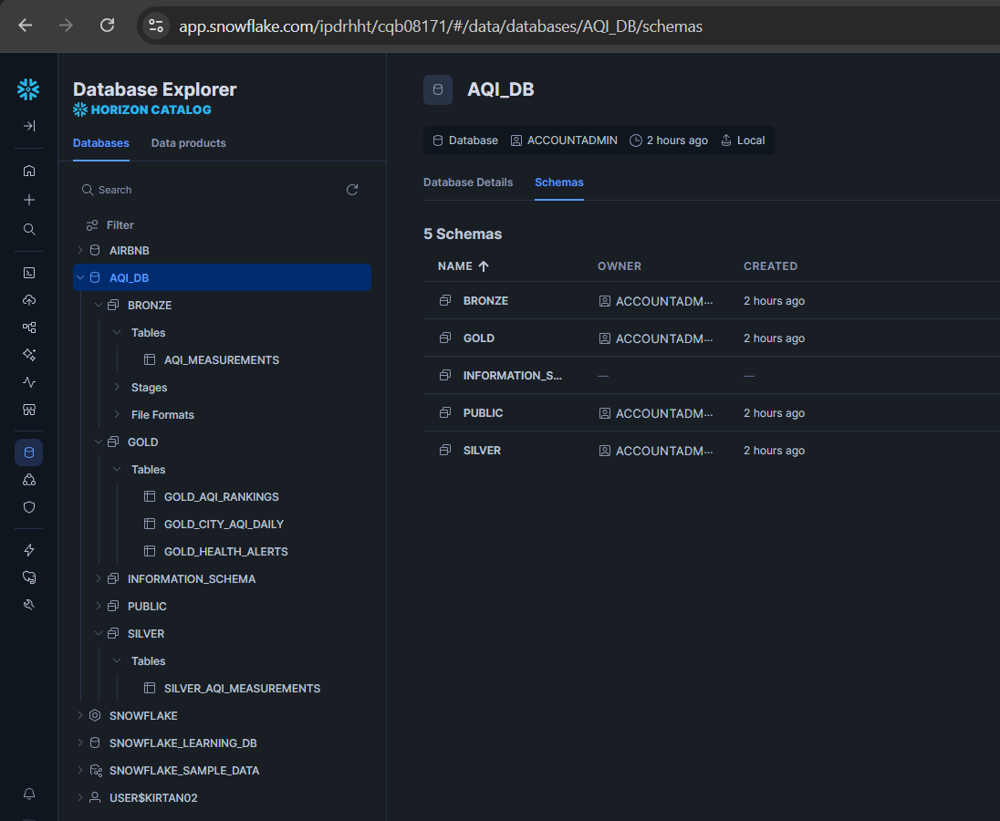
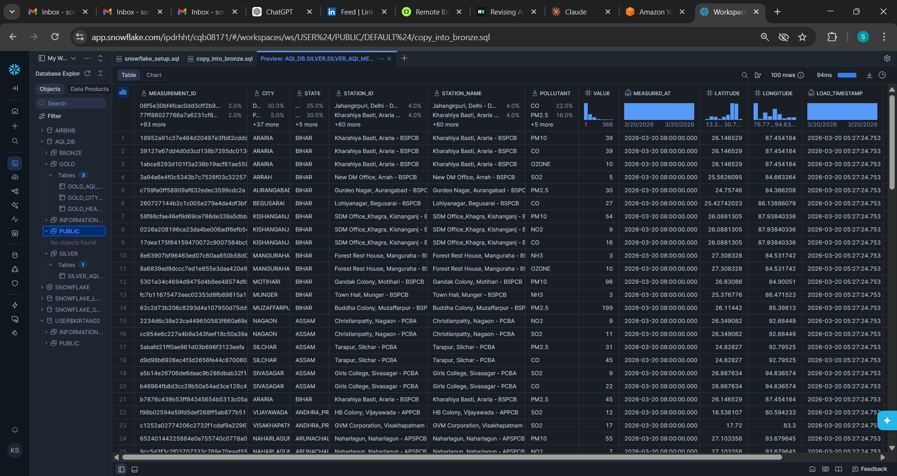
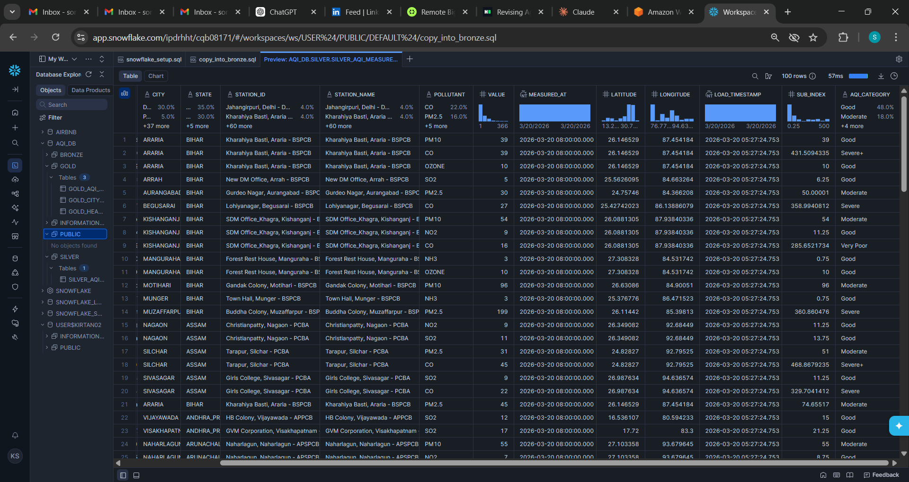
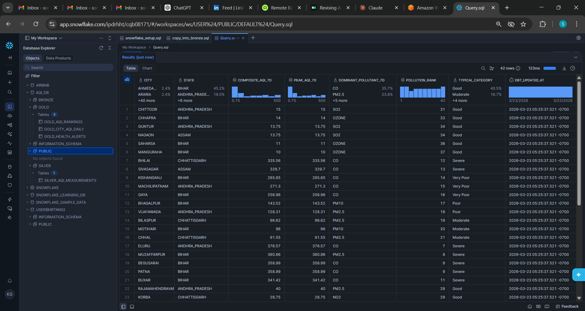
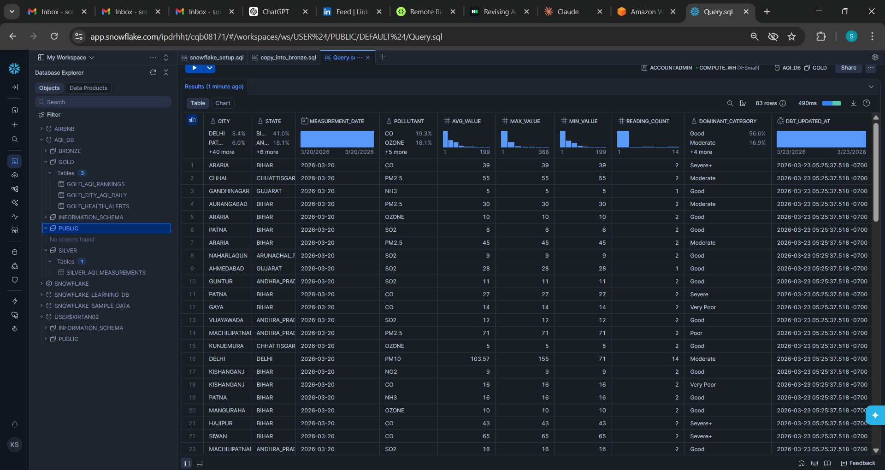
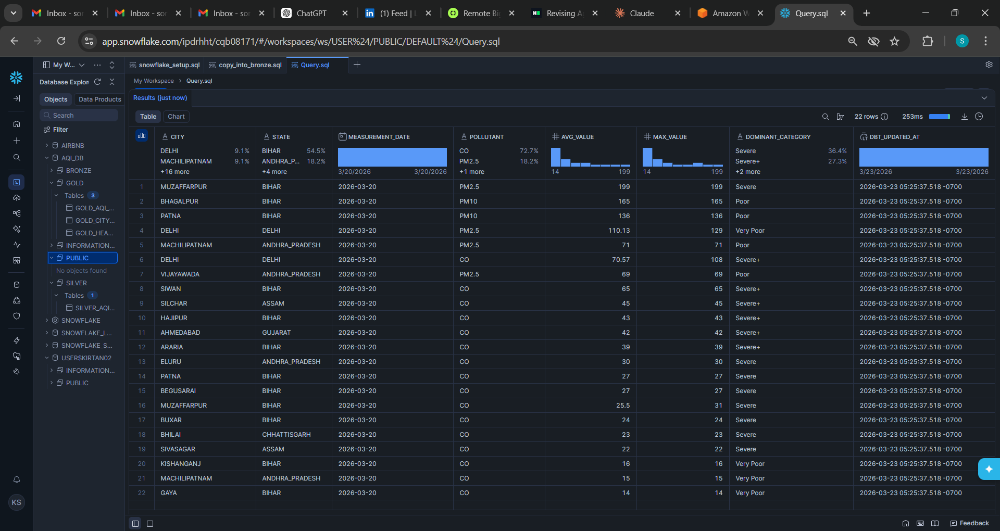

# AQI Data Pipeline

> **A comprehensive personal data engineering project for Air Quality Index (AQI) analytics** — end-to-end pipeline from real-time data ingestion to interactive Power BI dashboards using Airflow, dbt, Snowflake, and AWS.

**Repository**: [`AQI-DATA-PIPELINE`](https://github.com/kirtan-soni/AQI-DATA-PIPELINE)  
**Author**: [Kirtan Soni](https://github.com/kirtan-soni)  
**Email**: sonikirtan2004@gmail.com

[](https://www.python.org/downloads/release/python-3120/)
[](https://www.getdbt.com/)
[](https://airflow.apache.org/)
[](https://www.snowflake.com/)
[](https://www.docker.com/)

## 📋 Overview

This repository contains an end-to-end **ELT pipeline** that:
- **Ingests** real-time AQI data from Government of India's Open Data API
- **Transforms** raw JSON into business-ready analytics tables using dbt
- **Orchestrates** daily and backfill jobs via Airflow
- **Stores** data in Snowflake with S3 as the data lake
- **Enables** Power BI dashboards and downstream analytics

### Key Features
✅ Real-time AQI data ingestion from Government of India API  
✅ Incremental loading (no full table scans)  
✅ Data quality tests built-in (dbt tests)  
✅ Automated backfill capabilities for historical data  
✅ Multi-stage data warehouse (Bronze → Silver → Gold)  
✅ Interactive Power BI dashboards for analytics  
✅ Docker-based local and production deployment  
✅ Comprehensive logging and error handling  

---

## 🏗️ Architecture

### Architecture


### Infrastructure Components

<details open>
<summary><b>AWS S3 Data Lake</b></summary>



Stores raw JSON payloads from API ingestions before loading into Snowflake Bronze layer.
</details>

<details open>
<summary><b>Snowflake Data Warehouse</b></summary>



Multi-layer warehouse architecture:
- **Bronze**: Raw data ingestion
- **Silver**: Cleaned and validated data
- **Gold**: Business-ready analytics



Complete schema with Bronze/Silver/Gold layers and data lineage tracking.
</details>

### Data Flow Layers

| Layer | Purpose | Storage | Update Frequency |
|-------|---------|---------|------------------|
| **Bronze** | Raw ingestion, minimal transformation | Snowflake | Real-time (~10min) |
| **Silver** | Cleaned, deduplicated, enhanced | Snowflake | Real-time |
| **Gold** | Business aggregates, KPIs, metrics | Snowflake | Daily |

### silver_aqi_measurements (Result 1)



### silver_aqi_measurements (Result 2)



### gold_aqi_rankings



### gold_city_aqi_daily



### gold_health_alerts



---

## 🛠️ Tech Stack

| Component | Technology | Version |
|-----------|-----------|---------|
| **Language** | Python | 3.12 |
| **Package Manager** | uv | Latest |
| **Orchestration** | Apache Airflow | 3.1.7 |
| **Transformation** | dbt Core | + dbt-snowflake |
| **Data Warehouse** | Snowflake | - |
| **Data Lake** | AWS S3 | - |
| **Container** | Docker & Docker Compose | Latest |
| **Testing** | pytest | Latest |

---

## 📦 Project Structure

```
aqi_pipeline/
├── dags/                          # Airflow DAG definitions
│   ├── aqi_daily_dag.py          # Daily incremental load & transform
│   └── aqi_backfill_dag.py       # Historical data backfill
│
├── dbt/                           # dbt project (ELT transformations)
│   ├── models/
│   │   ├── bronze/               # Raw layer models
│   │   ├── silver/               # Cleaned layer models
│   │   └── gold/                 # Aggregated layer models
│   ├── macros/                   # Custom SQL functions
│   ├── tests/                    # Data quality tests
│   ├── dbt_project.yml           # dbt config
│   └── profiles.yml              # Snowflake connection config
│
├── include/
│   ├── scripts/
│   │   ├── fetch_ogd.py          # OGD API ingestion script
│   │   └── fetch_openaq.py       # OpenAQ API ingestion script
│   └── sql/
│       ├── snowflake_setup.sql   # Initial schema creation
│       └── copy_into_bronze.sql  # COPY INTO commands
│
├── tests/                         # pytest unit tests
│   ├── test_fetch_ogd.py
│   └── test_upload_s3.py
│
├── config/
│   └── airflow.cfg               # Airflow configuration
│
├── docker-compose.yml            # Local Airflow stack definition
├── Dockerfile.airflow            # Custom Airflow image
├── requirements.txt              # Python dependencies
├── requirements-airflow.txt      # Airflow-specific deps
├── pyproject.toml                # uv project config
├── Makefile                      # Development shortcuts
└── README.md                     # This file
```

---

## 🚀 Quick Start

### Prerequisites

- **Docker Desktop** (with `docker-compose`)
- **Snowflake Account** (free trial available)
- **AWS Account** with S3 bucket
- **OGD API Key** from [data.gov.in](https://data.gov.in)
- **Python 3.12+** (for local development)

### 1. Clone & Setup

```bash
# Clone repository
git clone https://github.com/kirtan-soni/AQI-DATA-PIPELINE.git
cd AQI-DATA-PIPELINE

# Copy environment template
cp .env.example .env

# Install dependencies (if developing locally)
uv sync
```

### 2. Configure Secrets

Edit `.env` with your credentials:

```env
# Snowflake
SNOWFLAKE_ACCOUNT=your_account.region
SNOWFLAKE_USER=your_user
SNOWFLAKE_PASSWORD=your_password
SNOWFLAKE_DATABASE=aqi_db
SNOWFLAKE_SCHEMA=raw
SNOWFLAKE_WAREHOUSE=compute_wh

# AWS S3
AWS_ACCESS_KEY_ID=your_key
AWS_SECRET_ACCESS_KEY=your_secret
AWS_S3_BUCKET=your-bucket
AWS_REGION=us-east-1

# APIs
OGD_API_KEY=your_ogd_key
OPENAQ_API_KEY=your_openaq_key (optional)

# Airflow Auth
AIRFLOW__WEBSERVER__SECRET_KEY=your_secret_key
AIRFLOW__API_AUTH__JWT_SECRET=your_jwt_secret
```

### 3. Start Local Airflow Stack

```bash
# Build and start services
docker-compose up -d

# Initialize Airflow DB (auto on first run)
docker-compose exec airflow-scheduler airflow db upgrade

# Create admin user
docker-compose exec airflow-scheduler airflow users create \
  --username admin \
  --firstname Admin \
  --lastname User \
  --role Admin \
  --email admin@example.com \
  --password admin
```

### 4. Access UI

- **Airflow WebUI**: http://localhost:8080
- **Credentials**: admin / admin

### 5. Trigger a DAG Run

```bash
# Daily pipeline
docker-compose exec airflow-scheduler airflow dags trigger aqi_daily_pipeline

# Or backfill (historical data)
docker-compose exec airflow-scheduler airflow dags trigger aqi_backfill_pipeline
```

---

## 📊 Power BI Dashboards

Interactive dashboards for real-time AQI analytics and monitoring:

- **City Health Dashboard**: Real-time AQI levels for major Indian cities with color-coded health warnings
- **Regional Analysis**: State-level aggregates, rankings, and trend analysis
- **Pollutant Breakdown**: PM2.5, PM10, NO₂, O₃, SO₂, CO levels by city and time period
- **Health Alerts**: Anomalies and thresholds violations triggering health recommendations
- **Historical Trends**: Year-over-year comparisons and seasonal patterns

**To Connect Power BI**:
1. Open Power BI Desktop
2. Get Data → Snowflake Database
3. Connect to your Snowflake account
4. Load tables from `AQI_DB.GOLD.*` schemas
5. Create visuals from the analytics tables

---

## 📊 DAG Details

### `aqi_daily_pipeline`

**Schedule**: Daily at 02:00 UTC  
**Duration**: ~5-10 minutes  
**Tasks**:
1. `fetch_ogd_api` — Fetch latest AQI data from OGD
2. `copy_into_bronze` — Load raw JSON to Snowflake BRONZE table
3. `dbt_run_silver` — Clean & deduplicate data
4. `dbt_run_gold` — Aggregate to daily city stats & rankings
5. `dbt_test` — Data quality checks
6. `log_completion` — Log success status

### `aqi_backfill_pipeline`

**Schedule**: Manual trigger only (on-demand)  
**Duration**: Variable (depends on date range)  
**Purpose**: Backfill historical AQI data (e.g., last 6 months)  
**Tasks**: Same as daily, but fetches historical data

---

## 🧪 Testing

### Run pytest locally

```bash
# Install test dependencies
uv sync --group test

# Run all tests
pytest

# Run specific test
pytest tests/test_fetch_ogd.py -v

# With coverage
pytest --cov=include/scripts tests/
```

### Run dbt tests

```bash
# Navigate to dbt directory
cd dbt

# Run data quality tests
dbt test

# Run specific test file
dbt test --select silver_aqi_measurements
```

---

## 📈 Monitoring & Logs

### View Airflow Logs

```bash
# Scheduler logs
docker-compose logs -f airflow-scheduler

# Worker logs
docker-compose logs -f airflow-worker

# Specific DAG task
docker-compose exec airflow-scheduler airflow tasks logs aqi_daily_pipeline fetch_ogd_api 2024-03-21
```

### Check DAG Health

```bash
# List all DAGs
docker-compose exec airflow-scheduler airflow dags list

# Get DAG status
docker-compose exec airflow-scheduler airflow dags list-runs -d aqi_daily_pipeline

# Inspect task states
docker-compose exec airflow-scheduler airflow tasks list aqi_daily_pipeline
```

---

## 🔧 Development

### Add a New dbt Model

```bash
# Create Silver model
touch dbt/models/silver/silver_new_metric.sql

# Add to sources.yml for documentation
# Run & test
dbt run --select silver_new_metric
dbt test --select silver_new_metric
```

### Add a New Airflow Task

Edit `dags/aqi_daily_dag.py`:

```python
new_task = BashOperator(
    task_id='my_new_task',
    bash_command='python /opt/airflow/include/scripts/my_script.py',
)
upstream_task >> new_task
```

### Deploy Changes

```bash
# Rebuild Airflow image (if Dockerfile changed)
docker-compose build --no-cache

# Restart services
docker-compose down
docker-compose up -d
```

---

## 🐛 Troubleshooting

### Issue: "Invalid auth token: Signature verification failed"

**Solution**: Ensure `AIRFLOW__WEBSERVER__SECRET_KEY` and `AIRFLOW__API_AUTH__JWT_SECRET` are identical across all Airflow services.

```bash
# Verify in running container
docker-compose exec airflow-scheduler airflow config get-value webserver secret_key
```

### Issue: Snowflake connection timeout

**Solution**: Check account identifier format and network:

```bash
# Correct format: account.region.cloud (e.g., xy12345.us-east-1.aws)
# Not: account (incorrect)
```

### Issue: S3 permission denied

**Solution**: Verify IAM S3 bucket policy grants your keys access:

```json
{
  "Version": "2012-10-17",
  "Statement": [
    {
      "Effect": "Allow",
      "Action": ["s3:GetObject", "s3:PutObject", "s3:ListBucket"],
      "Resource": ["arn:aws:s3:::your-bucket/*", "arn:aws:s3:::your-bucket"]
    }
  ]
}
```

---

## 📝 Environment Variables Reference

| Variable | Required | Default | Description |
|----------|----------|---------|-------------|
| `SNOWFLAKE_ACCOUNT` | ✅ | - | Snowflake account identifier |
| `SNOWFLAKE_USER` | ✅ | - | Snowflake username |
| `SNOWFLAKE_PASSWORD` | ✅ | - | Snowflake password |
| `SNOWFLAKE_DATABASE` | ✅ | `aqi_db` | Database name |
| `SNOWFLAKE_WAREHOUSE` | ✅ | `compute_wh` | Warehouse name |
| `AWS_ACCESS_KEY_ID` | ✅ | - | AWS access key |
| `AWS_SECRET_ACCESS_KEY` | ✅ | - | AWS secret key |
| `AWS_S3_BUCKET` | ✅ | - | S3 bucket name |
| `OGD_API_KEY` | ✅ | - | OGD API key |
| `OPENAQ_API_KEY` | ❌ | - | OpenAQ API key (optional) |

---

## 🚨 Production Deployment

Before deploying to production:

1. **Replace placeholder secrets** in `.env` with strong, unique values
2. **Enable Snowflake IP whitelisting** to restrict access
3. **Set up AWS IAM roles** instead of access keys (if possible)
4. **Enable Airflow user authentication** (not local executor)
5. **Configure persistent volumes** for logs and data
6. **Set up monitoring** (DataDog, New Relic, etc.)
7. **Test backfill scenarios** thoroughly
8. **Document runbooks** for operations team

---

## 📚 Resources

- [Apache Airflow Documentation](https://airflow.apache.org/docs/)
- [dbt Documentation](https://docs.getdbt.com/)
- [Snowflake Documentation](https://docs.snowflake.com/)
- [OGD API Docs](https://data.gov.in/)

---

## 🤝 Contributing

1. Create a feature branch: `git checkout -b feature/my-feature`
2. Make changes and test thoroughly
3. Commit with clear messages: `git commit -m "feat: add new metric"`
4. Push and submit a pull request

---

## ✉️ Contact

**Maintained by**: [Kirtan Soni](https://github.com/kirtan-soni)  
**Email**: sonikirtan2004@gmail.com  
**Personal Project**: This is a comprehensive data engineering portfolio project  
**Questions or issues?** Open a GitHub issue or contact via email

---

**Last updated**: March 2026
